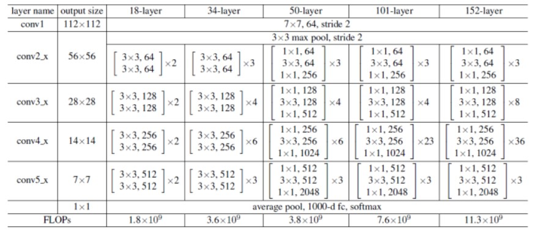

# ResNet

## 论文学习

### Abstract

Can ease the training of networks that are substantially deeper than those used previously.

explicitly reformulate the layers as **learning residual functions** with reference to the **layer inputs**.

the depth of representations is of central importance for many visual recognition tasks.

### Introduction

problem of vanishing/exploding gradients has been largely addressed by normalised initialization and intermediate normalization layers.

When deeper networks are able to **start converging**, a degradation problem has been exposed: with the network depth increasing, **accuracy gets saturated**, and then **degrades rapidly**. Unexpectedly, such degradation is **not caused by overfitting**, and **adding more layers to a suitably deep model leads to higher training error.**

Addressing the degradation problem by introducing a deep residual learning framework.

### Related Work

#### Residual representations

VLAD and Fisher Vector are both powerful shallow representations for image tasks.

For vector quantization, encoding residual vectors is shown to be more effective than encoding original vectors.

good reformulation or preconditioning can simplicity the optimization.

#### Shortcut Connections

add a linear layer connected from the network input to the output. 

a few intermediate layers are directly connected to auxiliary classifiers for addressing vanishing/exploding gradients.

present shortcut connections with gating functions which is data-dependent and have parameters.

### Deep residual Learning

the degradation problem suggests that the solvers might have difficulties in approximating identity mappings by multiple nonlinear layers.

with the residual learning reformulation, if identity mappings are optimal, the solvers may simply drive the weights of the multiple non-linear layers **toward zero to** approach identity mappings.

learned residual functions in general have small responses, suggesting that identity mappings provide **reasonable preconditioning**.

two options when the dimension changed in non-linear layers:

- the short cut still performs identity mapping, with extra zero entries padded for increasing dimensions
- the projection shortcut is used to match dimensions

#### comparison of these two options

argue that, the zero-padded dimensions indeed have no residual learning

but the projection shortcuts are not essential for addressing the degradation problem.

### Deeper Bottleneck Architectures

due to the practical consideration, we adopt the bottleneck design.


for each residual block, use a stack of 3 layers instead of 2. they are $1 \times 1, 3 \times 3, 1 \times 1$, convolutions, where the $1 \times 1$ layers are responsible for **reducing and then increasing (restoring) dimensions**. So the $3 \times 3$ layer is acting as a bottleneck **with smaller dimension**.

the **parameter-free identity shortcuts** are particularly important for the bottleneck architectures.

## Pytorch 源码使用学习

#### 对卷积核进行封装，最简单的封装

封装了两个唯一要用到的卷积核，分别是$3 \times 3$ 和 $1 \times  1$ 大小的卷积核。这里我们具体学习一下torch里自带的conv所需要的参数有什么：

- in_channels & out_channels: 最简单定义的就是通道数，output通道数就决定了这一层卷积核的个数
- kernel_size：定义卷积核的大小，配合padding使用来进行一定的图像缩放作用； 配合前两个参数就可以计算出卷积使用的参数的大小，$in\_channels \times out\_channels \times kernel\_size$
- stride: 也就是步长，可以成倍的缩小图像
- padding：就是对原来的图像进行合理的padding，使得输出输入图像的大小保持一致。只要卷积核大于一都应该设置这个以保证图像大小的一致性
- padding mode：对应的就是padding使用的方式，可以选用的值有zero, reflect, replicate, circular
- dilation：表示的卷积核元素之间的距离，初始值为1。这个用于与图像像素位置的对齐。用于卷积和感受野的设置，可以在同样的参数量下获得更大的感受野（学习**膨胀卷积**的应用以及意义）
- group: 控制输入通道与输出通道之间的连接方式，实现**组卷积**

有了上面的概念之后，可以自己尝试封装一下所需要的卷积核，意义就是在后续使用的时候可以减少参数的重复设置

```python
def con3x3(in_planes: int, out_planes: int, stride: int = 1, groups: int = 1, dilation: int = 1) -> nn.Conv2d:
        return nn.Conv2d(
        	in_channels = in_planes,
            out_channels = out_planes,
            kernel_size = 3,
            padding = dilation,
            stride = stride,
            groups = groups,
            dilation = dilation,
            bias = False
        )
   
def con1x1(in_planes: int, out_planes: int, stride: int = 1) -> nn.Conv2d:
    return nn.Conv2d(in_planes, out_planes, kernel_size=1, stride = stride, bias=False)
```

这种写法可以增加代码的可读性，并且现在还有很多深度学习代码在开始也会将卷积层，BN层和激活函数层封装到一起，进一步简化代码量。



### Basic Block & Bottleneck Block

两个都应该要继承自nn.Module

resnet网络中由很多相同的模块堆叠起来，为了保证代码具有可读性和扩展性，使用模块化的设计会更加方便。

basic block就是最基础的Resnet的一个block，主要就是由一个两个卷积层和一个激活函数组成的residual function和一个shortcut进行连接，再进行一次激活组成的

bottleneck block就是为了应用在更深网络时，减少一定量的参数运算，首先通过$1\times 1$的卷积层对维度进行缩小，缩小到输入的一半，然后再通过$3 \times 3$的卷积层进行学习，最后再进一次$1 \times 1$的卷积层对维度进行扩大，扩大为输入的两倍，也可以说是$3 \times 3$ 输出维度的4倍

同时，根据不同层层数的Resnet，会在每一组（每一次图像大小缩小，维度增加的时候），堆叠不同个数的basic block来做特征提取

为了控制输入和输出的通道数目的变化，在代码中输出的通道维度也通过**expansion**进行控制，表示这个block要expansion的倍数是多少

两个block类输入一个通道为in_planes维的度特征图， planes是中间层的维度大小，输出一个planes*expansion维的特征图

```python
class BasicBlock(nn.Module):
    expansion: int = 1
    def __init__(
    	self,
        inplanes: int,
        planes: int,
        stride: int,
        downsample: Optional[nn.Module] = None,
        groups: int = 1,
        base_width: int = 64,
        dilation: int = 1,
        norm_layer: Optional[Callable[..., nn.Module]] = None
        # Callable 表示可调用对象，例如函数，类实例。...用于表示可以接受任何参数，返回值必须是nn.Module
    ) -> None:
        super().__init__()
        if norm_layer == None:
            norm_layer = nn.BatchNorm2d
        if groups != 1 or base_width != 64:
            raise ValueError("Not acceptable values for group or base_width")
        if dilation > 1:
            raise NotImplementedError("Dilation > 1 not supported")
        
        self.conv1 = conv3x3(inplanes, planes, stride)
        self.bn1 = norm_layer(planes)
        self.relu1 = nn.ReLU(inplace = True)
        self.conv2 = conv3x3(planes, planes, stride)
        self.bn2 = norm_layer(planes)
        
        self.downsample = downsample
        self.stride = stride
        
    def forward(self, x: Tensor) -> Tensor:
        identity = x
        out = self.conv1(x)
        out = self.bn1(out)
        out = self.relu(out)

        out = self.conv2(out)
        out = self.bn2(out)

        if self.downsample is not None:
            identity = self.downsample(x)

        out += identity
        out = self.relu(out)

        return out
        
        
```

在BatchNorm层中，是有引入可训练参数的。调用时最重要的一个参数就是要输入通道的大小。BatchNorm是针对每个通道对一个batch内的所有样本进行归一化。所以要指定通道大小

具体的公式是下面，在前面的标准归一化之后，又引入了$\gamma, \beta$ 作为可学习的参数。这两个参数可以让网络恢复对标准化特征的表达能力，分别控制尺度与偏移。
$$
y = \frac{x - E[x]}{\sqrt{Var[X] + \epsilon}} * \gamma + \beta
$$

```python
class Bottleneck(nn.Module):
    expansion = 4
    
    def __init__(
    	self,
        inplanes: int,
        planes: int,
        stride: int = 1,
        downsample: Opational[nn.Module] = None,
        groups: int = 1,
        base_width: int = 64,
        dilation: int = 1,
        norm_layer: Optional[Callable[..., nn.Module]] = None
    ) -> None:
        super().__init__()
        if norm_layer is None:
            norm_layer = nn.BatchNorm2d
        width = int(planes * (base_width / 64.0)) * groups    # 这个计算的是每组卷积中，实际的通道数
        self.conv1 = conv1x1(inplanes, width)
        self.bn1 = norm_layer(width)
        self.conv2 = conv3x3(width, width, stride, groups, dilation)
        self.bn2 = norm_layer(width)
        self.conv3 = conv1x1(width, planes * self.expansion)
        self.bn3 = norm_layer(planes * self.expansion)
        self.relu = nn.ReLU(inplace = True)
        
        self.downsample = downsample
        self.stride = stride
    
    def forward(self, x :Tensor) -> Tensor:
        identity = x
        out = self.relu(self.bn1(self.conv1(x)))
        
        out = self.relu(self.bn2(self.conv2(out)))
        
        out = self.bn3(self.conv3(out))
        
        if self.downsample is not None:
            identity = self.downsample(x)
        
        out += identity
        out = self.relu(out)
        return out
        
```

这里有一个点不太确定的就是，当进行组卷积的时候，width是否是原来的配置大小的两倍？因为从最基础的来讲，就是base_width都一致的情况下，width的大小也是planes的groups倍。

### ResNet 的源码

```python
class ResNet(nn.Module):
    def __init__(self,
                block: Type[Union[BasicBlock, Bottleneck]],
                layers: List[int],
                num_classes: int = 1000,
                zero_init_residual: bool = False,
                groups: int = 1,
                width_per_group: int = 64,    # is it the same as base_width?
                replace_stride_with_dilation: Optional[List[bool]] = None,
               	norm_layer: Optional[Callable[..., nn.Module]] = None
                ) -> None:
        super().__init__()
        if norm_layer is None:
            norm_layer = nn.BatchNorm2d
        self
        
```


