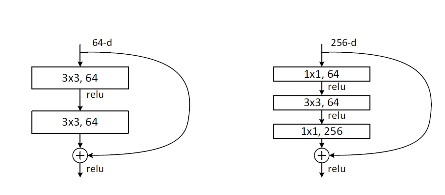

# ResNet

## 论文学习

### Abstract

Can ease the training of networks that are substantially deeper than those used previously.

explicitly reformulate the layers as **learning residual functions** with reference to the **layer inputs**.

the depth of representations is of central importance for many visual recognition tasks.

### Introduction

problem of vanishing/exploding gradients has been largely addressed by normalised initialization and intermediate normalization layers.

When deeper networks are able to **start converging**, a degradation problem has been exposed: with the network depth increasing, **accuracy gets saturated**, and then **degrades rapidly**. Unexpectedly, such degradation is **not caused by overfitting**, and **adding more layers to a suitably deep model leads to higher training error.**

Addressing the degradation problem by introducing a deep residual learning framework.

### Related Work

#### Residual representations

VLAD and Fisher Vector are both powerful shallow representations for image tasks.

For vector quantization, encoding residual vectors is shown to be more effective than encoding original vectors.

good reformulation or preconditioning can simplicity the optimization.

#### Shortcut Connections

add a linear layer connected from the network input to the output. 

a few intermediate layers are directly connected to auxiliary classifiers for addressing vanishing/exploding gradients.

present shortcut connections with gating functions which is data-dependent and have parameters.

### Deep residual Learning

the degradation problem suggests that the solvers might have difficulties in approximating identity mappings by multiple nonlinear layers.

with the residual learning reformulation, if identity mappings are optimal, the solvers may simply drive the weights of the multiple non-linear layers **toward zero to** approach identity mappings.

learned residual functions in general have small responses, suggesting that identity mappings provide **reasonable preconditioning**.

two options when the dimension changed in non-linear layers:

- the short cut still performs identity mapping, with extra zero entries padded for increasing dimensions
- the projection shortcut is used to match dimensions

#### comparison of these two options

argue that, the zero-padded dimensions indeed have no residual learning

but the projection shortcuts are not essential for addressing the degradation problem.

### Deeper Bottleneck Architectures

due to the practical consideration, we adopt the bottleneck design.



for each residual block, use a stack of 3 layers instead of 2. they are $1 \times 1, 3 \times 3, 1 \times 1$, convolutions, where the $1 \times 1$ layers are responsible for **reducing and then increasing (restoring) dimensions**. So the $3 \times 3$ layer is acting as a bottleneck **with smaller dimension**.

the **parameter-free identity shortcuts** are particularly important for the bottleneck architectures.

## Pytorch 源码使用学习

#### 对卷积核进行封装，最简单的封装

封装了两个唯一要用到的卷积核，分别是$3 \times 3$ 和 $1 \times  1$ 大小的卷积核。这里我们具体学习一下torch里自带的conv所需要的参数有什么：

- in_channels & out_channels: 最简单定义的就是通道数，output通道数就决定了这一层卷积核的个数
- kernel_size：定义卷积核的大小，配合padding使用来进行一定的图像缩放作用； 配合前两个参数就可以计算出卷积使用的参数的大小，$in\_channels \times out\_channels \times kernel\_size$
- stride: 也就是步长，可以成倍的缩小图像
- padding：就是对原来的图像进行合理的padding，使得输出输入图像的大小保持一致。只要卷积核大于一都应该设置这个以保证图像大小的一致性
- padding mode：对应的就是padding使用的方式，可以选用的值有zero, reflect, replicate, circular
- dilation：表示的卷积核元素之间的距离，初始值为1。这个用于与图像像素位置的对齐。用于卷积和感受野的设置，可以在同样的参数量下获得更大的感受野（学习**膨胀卷积**的应用以及意义）
- group: 控制输入通道与输出通道之间的连接方式，实现**组卷积**

有了上面的概念之后，可以自己尝试封装一下所需要的卷积核，意义就是在后续使用的时候可以减少参数的重复设置

```python
def con3x3(in_planes: int, out_planes: int, stride: int = 1, groups: int = 1, dilation: int = 1) -> nn.Conv2d:
        return nn.Conv2d(
        	in_channels = in_planes,
            out_channels = out_planes,
            kernel_size = 3,
            padding = dilation,
            stride = stride,
            groups = groups,
            dilation = dilation,
            bias = False
        )
   
def con1x1(in_planes: int, out_planes: int, stride: int = 1) -> nn.Conv2d:
    return nn.Conv2d(in_planes, out_planes, kernel_size=1, stride = stride, bias=False)
```

这种写法可以增加代码的可读性，并且现在还有很多深度学习代码在开始也会将卷积层，BN层和激活函数层封装到一起，进一步简化代码量。


### Basic Block & Bottleneck Block

两个都应该要继承自nn.Module

resnet网络中由很多相同的模块堆叠起来，为了保证代码具有可读性和扩展性，使用模块化的设计会更加方便。

basic block就是最基础的Resnet的一个block，主要就是由一个两个卷积层和一个激活函数组成的residual function和一个shortcut进行连接，再进行一次激活组成的

bottleneck block就是为了应用在更深网络时，减少一定量的参数运算，首先通过$1\times 1$的卷积层对维度进行缩小，缩小到输入的一半，然后再通过$3 \times 3$的卷积层进行学习，最后再进一次$1 \times 1$的卷积层对维度进行扩大，扩大为输入的两倍，也可以说是$3 \times 3$ 输出维度的4倍

同时，根据不同层层数的Resnet，会在每一组（每一次图像大小缩小，维度增加的时候），堆叠不同个数的basic block来做特征提取

为了控制输入和输出的通道数目的变化，在代码中输出的通道维度也通过**expansion**进行控制，表示这个block要expansion的倍数是多少

两个block类输入一个通道为in_planes维的度特征图， planes是中间层的维度大小，输出一个planes*expansion维的特征图

```python
class BasicBlock(nn.Module):
    expansion: int = 1
    def __init__(
    	self,
        inplanes: int,
        planes: int,
        stride: int,
        downsample: Optional[nn.Module] = None,
        groups: int = 1,
        base_width: int = 64,
        dilation: int = 1,
        norm_layer: Optional[Callable[..., nn.Module]] = None
        # Callable 表示可调用对象，例如函数，类实例。...用于表示可以接受任何参数，返回值必须是nn.Module
    ) -> None:
        super().__init__()
        if norm_layer == None:
            norm_layer = nn.BatchNorm2d
        if groups != 1 or base_width != 64:
            raise ValueError("Not acceptable values for group or base_width")
        if dilation > 1:
            raise NotImplementedError("Dilation > 1 not supported")
        
        self.conv1 = conv3x3(inplanes, planes, stride)
        self.bn1 = norm_layer(planes)
        self.relu1 = nn.ReLU(inplace = True)
        self.conv2 = conv3x3(planes, planes, stride)
        self.bn2 = norm_layer(planes)
        
        self.downsample = downsample
        self.stride = stride
        
    def forward(self, x: Tensor) -> Tensor:
        identity = x
        out = self.conv1(x)
        out = self.bn1(out)
        out = self.relu(out)

        out = self.conv2(out)
        out = self.bn2(out)

        if self.downsample is not None:
            identity = self.downsample(x)

        out += identity
        out = self.relu(out)

        return out
        
        
```

在BatchNorm层中，是有引入可训练参数的。调用时最重要的一个参数就是要输入通道的大小。BatchNorm是针对每个通道对一个batch内的所有样本进行归一化。所以要指定通道大小

具体的公式是下面，在前面的标准归一化之后，又引入了$\gamma, \beta$ 作为可学习的参数。这两个参数可以让网络恢复对标准化特征的表达能力，分别控制尺度与偏移。
$$
y = \frac{x - E[x]}{\sqrt{Var[X] + \epsilon}} * \gamma + \beta
$$

```python
class Bottleneck(nn.Module):
    expansion = 4
    
    def __init__(
    	self,
        inplanes: int,
        planes: int,
        stride: int = 1,
        downsample: Opational[nn.Module] = None,
        groups: int = 1,
        base_width: int = 64,
        dilation: int = 1,
        norm_layer: Optional[Callable[..., nn.Module]] = None
    ) -> None:
        super().__init__()
        if norm_layer is None:
            norm_layer = nn.BatchNorm2d
        width = int(planes * (base_width / 64.0)) * groups    # 这个计算的是每组卷积中，实际的通道数
        self.conv1 = conv1x1(inplanes, width)
        self.bn1 = norm_layer(width)
        self.conv2 = conv3x3(width, width, stride, groups, dilation)
        self.bn2 = norm_layer(width)
        self.conv3 = conv1x1(width, planes * self.expansion)
        self.bn3 = norm_layer(planes * self.expansion)
        self.relu = nn.ReLU(inplace = True)
        
        self.downsample = downsample
        self.stride = stride
    
    def forward(self, x :Tensor) -> Tensor:
        identity = x
        out = self.relu(self.bn1(self.conv1(x)))
        
        out = self.relu(self.bn2(self.conv2(out)))
        
        out = self.bn3(self.conv3(out))
        
        if self.downsample is not None:
            identity = self.downsample(x)
        
        out += identity
        out = self.relu(out)
        return out
        
```

这里有一个点不太确定的就是，当进行组卷积的时候，width是否是原来的配置大小的两倍？因为从最基础的来讲，就是base_width都一致的情况下，width的大小也是planes的groups倍。

### ResNet 的源码

#### init 函数学习

```python
class ResNet(nn.Module):
    def __init__(
        self,
        block: Type[Union[BasicBlock, Bottleneck]],
        layers: List[int],       # 这里为什么是一个int的列表？传入的是每一个大模块layer的个数嘛？
        num_classes: int = 1000,
        zero_init_residual: bool = False,
        groups: int = 1,
        width_per_group: int = 64,    # is it the same as base_width?
        replace_stride_with_dilation: Optional[List[bool]] = None,
        norm_layer: Optional[Callable[..., nn.Module]] = None
    ) -> None:
        super().__init__()
        if norm_layer is None:
            norm_layer = nn.BatchNorm2d
        self.norm_layer = norm_layer

        self.in_planes = 64
        self.dilation = 1
        # 理解这里这样处理的意义是什么
        if replace_stride_with_dilation is None:
            replace_stride_with_dilation = [False, False, False]
        if len(replace_stride_with_dilation) != 3:
            raise ValueError(
                "replace_stride_with_dilation should be None"
                f"or a 3-element tuple, got {replace_stride_with_dilation}"
            )
        self.groups = groups
        self.base_width = width_per_group
        self.conv1 = nn.Conv2d(3, self.in_planes, kernel_size = 7, stride = 2, padding=3, bias=False)
        self.bn1 = self.norm_layer(self.in_planes)

        self.relu = nn.ReLU(inplace=True)
        self.maxpool = nn.MaxPool2d(kernel_size=3, stride=2, padding=1)

        self.layer1 = self._make_layer(block, 64, layers[0])
        self.layer2 = self._make_layer(block, 128, layers[1], stride = 2, dilate = replace_stride_with_dilation[0])
        self.layer3 = self._make_layer(block, 256, layers[2], stride = 2, dilate = replace_stride_with_dilation[1])
        self.layer4 = self._make_layer(block, 512, layers[3], stride = 2, dilate = replace_stride_with_dilation[2])

        self.avgpool = nn.AdaptiveAvgPool2d((1, 1))     # 经过average pooling之后，每个维度就只剩下一个值了，所以呢，只需要考虑维度的个数即可
        self.fc = nn.Linear(512 * block.expansion, num_classes)

        for m in self.modules():
            if isinstance(m, nn.Conv2d):
                nn.init.kaiming_normal_(m.weight, mode="fan_out", nonlinearity = "relu")
            elif isinstance(m, (nn.BatchNorm2d, nn.GroupNorm)):
                nn.init.constant_(m.weight, 1)
                nn.init.constant_(m.bias, 0)
        
        if zero_init_residual:       # 这个初始化会使得整个模型在初始时更偏向于恒等连接，对于残差连接的学习会减少扰动，使得更快的收敛
            for m in self.modules:
                if isinstance(m, Bottleneck) and m.bn3.weight is not None:    # 并且这里只需要对最后一个bn层进行重置
                    nn.init.constant_(m.bn3.weight, 0) 
                elif isinstance(m, BasicBlock) and m.bn2.weight is not None:
                    nn.init.constant_(m.bn2.weight, 0) 
```

##### 参数

- block：这里表示整个resnet网络组成的基本部分是什么
- layers： 这个参数暂时还没有直观的定义，但是可以大致理解为每一个大的block中有多少层block，所以是一个int类型的列表
- num_classes：并没有使用到
- zero_init_residual：是否使用零来初始化残差部分，在后面会讲到对应的操作
- groups：分组卷积
- width_per_group：设置base_width
- replace_stride_with_dilation，norm_layer，这些都是resnet的可选择参数，暂时不做解释了

##### replace_stride_width_dilation

这个操作首先要接受的变量是一个三元的列表，表示的是每一个大block的第一个卷积操作是否用dilation来代替stride。

这样操作最直接的影响是，dilation不会导致分辨率的下降，而stride会导致分辨率的成倍下降

这么操作的意义是

**保持特征图分辨率**：适用于需要高分辨率输出的任务（如语义分割）。

**增大感受野**：在不增加计算参数的情况下捕获更大的上下文信息。

**适用任务**：主要用于语义分割、目标检测等密集预测任务。

##### _make_layer

这里是一个函数来快速的构建一整层的layer，包括第一个convolution的降维，以及self.inplanes的更新

这个在下一个小章节会根据代码详细的介绍

##### zero_init_residual

这个初始化会使得整个模型在初始时更偏向于恒等连接，对于残差连接的学习会减少扰动，使得更快的收敛

实现的方式就是在每一个大的block中，将最后一个batchnorm的参数设置为0即可

#### make_layer

```python
def _make_layer(
        self,
        block: Type[Union[BasicBlock, Bottleneck]],
        planes: int,
        blocks: int,
        stride: int = 1,
        dilate: bool = False
    ) -> nn.Sequential:
        norm_layer = self.norm_layer
        downsample = None
        previous_dilation = self.dilation
        
        # 这里是如果要用膨胀卷积来代替stride的时候，对dilation重新进行计算
        if dilate:
            self.dilation *= stride
            stride = 1
        if stride != 1 or self.inplanes != planes * block.expansion:
            downsample = nn.Sequential(
                conv1x1(self.in_planes, planes*block.expansion, stride),
                norm_layer(planes * block.expansion)
            )
        # 从这这里开始就要具体问题具体分析了
        layers = []
        layers.append(
            block(
                self.inplanes, planes, stride, downsample, self.groups, self.base_width, previous_dilation, norm_layer
            )
        )
        # 这里的第一个完成的是降低分辨率，并且加深通道的操作，也只有这一层是需要downsample来对其特征大小的

        self.inplanes = planes * block.expansion     # 为下一层的block设置当前的block的输出大小

        for _ in range(1, blocks):
            layers.append(
                block(
                    self.inplanes,
                    planes,
                    groups=self.groups,
                    base_width=self.base_width,
                    dilation=self.dilation,
                    norm_layer=norm_layer,
                )
            )
        return nn.Sequential(*layers)
```

我觉得看着一段代码，最重要的是不要被他的操作给唬住了，我们要先看，最后具体生成的block中使用了什么block来判断这个block起到的作用是什么

首先layers是存储了这一个block中所有层的一个列表。

##### 第一层是什么

block(self.inplanes, planes, stride, downsample, self.groups, self.base_width, previous_dilation, norm_layer)

只有这里的block是传入了downsample参数的，具体就是完成downsample的一个函数

而这个参数要产生的条件是又前一个if中产生的，条件就是当stride不是1，或者self.inplanes的大小与通过整个模块后的大小不一致的时候，才需要downsample的参数

同时，如果使用了replace_stride_with_dilation的操作的话，会更新对应的dilation与stride的大小，但是第一个block使用的已然是previous_dilation

##### 后面的n层

我们可以看到在添加了第一个block之后，代码更新了整个self.inplanes，意味着后面的输入都是由这个大小开始了，比较好的处理了维度的匹配问题！

就是简单的堆叠一下剩下的block就好了

### ResNet的使用方法

```python
def _resnet(
    block: Type[Union[BasicBlock, Bottleneck]],
    layers: List[int],
    weights: Optional[WeightsEnum],
    progress: bool,
    **kwargs: Any,
) -> ResNet:
    if weights is not None:
        _ovewrite_named_param(kwargs, "num_classes", len(weights.meta["categories"]))   
        # 这里的意思就是需要按照权重中categories上的存储记录来录入
    model = ResNet(block, layers, **kwargs)
    if weights is not None:            # 加载weights
        model.load_state_dict(weights.get_state_dict(progress = progress, check_hash=True))
    return model
```

这里单独开了一个函数来做ResNet的初始化，主要的目的是获取num_classes以及加载具体的权重值

这里想就这里的参数来讲一下具体使用到的一些工具，以及使用的方法与意义

- layers：定义每个阶段中残差块的数量，决定了模型的深度与层次结构
- weights：定义了是否加载预训练权重以及加载哪种权重，定义的类型是WeightEnum是一个枚举类型，列举了所有支持的预训练权重
- progress：控制加载预训练权重时是否显示下载的进度条，仅仅是为了方便用户在加载大模型时知道进度

#### Resnet50的参数定义如下

```python
class ResNet50_Weights(WeightsEnum):
    IMAGENET1K_V1 = ...
    IMAGENET1K_V2 = Weights(
        url="https://download.pytorch.org/models/resnet50-11ad3fa6.pth",
        transforms=partial(ImageClassification, crop_size=224, resize_size=232),
        meta={
            **_COMMON_META,
            "num_params": 25557032,
            "recipe": "https://github.com/pytorch/vision/issues/3995#issuecomment-1013906621",
            "_metrics": {
                "ImageNet-1K": {
                    "acc@1": 80.858,
                    "acc@5": 95.434,
                }
            },
            "_ops": 4.089,
            "_file_size": 97.79,
            "_docs": """
                These weights improve upon the results of the original paper by using TorchVision's `new training recipe
                <https://pytorch.org/blog/how-to-train-state-of-the-art-models-using-torchvision-latest-primitives/>`_.
            """,
        },
    )
    DEFAULT = IMAGENET1K_V2


@register_model()
@handle_legacy_interface(weights=("pretrained", ResNet50_Weights.IMAGENET1K_V1))
def resnet50(*, weights: Optional[ResNet50_Weights] = None, progress: bool = True, **kwargs: Any) -> ResNet:

    weights = ResNet50_Weights.verify(weights)
    
    return _resnet(Bottleneck, [3, 4, 6, 3], weights, progress, **kwargs)

```

下面就是介绍一下学习的点：

**partial函数**：

这是一个functool的函数，输入python的内置方法。具体的用法是为一个函数限定一个参数的输入

就像一个装饰器，封装了一个参数的值，然后在内部调用被装饰的函数然后传入封装的值

**default:**

指定了默认的权重版本，如果用户在加载权重时没有明确指定使用哪个版本的权重，则使用这个默认值

**@register_model()**：

将resnet50注册为一个可用的模型，可能是某个模型管理系统的一部分，便于用户通过统一的方式调用预定义的模型。

**@handle_legacy_interface(weights=("pretrained", ResNet50_Weights.IMAGENET1K_V1))**

这个可以兼容旧版用户传入，pretrain=True时没有指定对应权重版本时的情况

将其替换为 `weights=ResNet50_Weights.IMAGENET1K_V1`，以对应当前版本使用的函数


