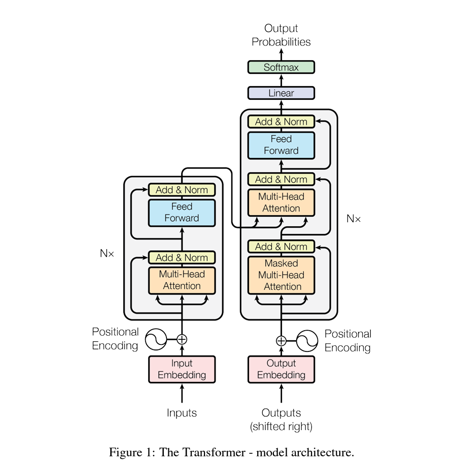

## Attention is all you need

[paper address](https://proceedings.neurips.cc/paper/2017/hash/3f5ee243547dee91fbd053c1c4a845aa-Abstract.html)

#### important concept

use stacked self-attention and point-wise, fully connected layers for both the encoder and decoder

##### encoder

stack of N = 6 identical layers. Each layer has two sub-layer. 

* The first is a multi-head self-attention mechanism

* second is a simple, position-wise fully connected feed-forward network

employ **residual connection** around each of the two sub-layers, followed by **layer normalization**

To facilitate the connections, all the outputs dimension are the same: $d_(embedding) = d_(model) = 512$

##### decoder

also stack of N = 6 identical layers.

* insert a sub-layer between the two layers, which performs multi-head attention over the output of the encoder stack.
* self-attention is masked to prevent positions from attending to subsequent positions.
* the masking ensure that the predictions for position $i$  can depend only on the known outputs at positions less than $i$

#### Attention

Scaled Dot-Product Attention

There are three parameterized matrix that are intend to learn the attention from the text: $M_Q, M_K, M_V$

As the name, embedding or sequence are multiplied with the above three matrix to generate middle feature:
$$
\begin{align}
E_Q = Embedding * M_Q \\
E_K = Embedding * M_K \\
E_V = Embedding * M_V \\
\end{align}
$$

The $Q , K$ are multiplied to generate the attention matrix and masked
$$
Mask(Q K^T)
$$
 then it would scaled by the $1/\sqrt{d_k}$, applied the softmax to generate the probability, then multiply with V to get final score
$$
Attention(Q, K, V)= Softmax(\frac{QK^T}{\sqrt{d_k}}) V
$$
why scaled? For large values of $d_k$, the dot product attention grow large in magnitude, pushing the softmax function into regions where it has extremely small gradients (same effect as the gradient vanish). So the scaled one can mitigate this effect.

#### multi-head attention

instead of performing a single attention function, linearly project the queries, keys and values $h$ times with different, learned linear projections to $d_k, d_k, d_v$ dimensions respectively. And then perform the attention function in parallel, yielding $d_V$ dimension output values. They would be concatenated and once again projected, resulting in the final values.

employ $h = 8$ parallel attention layers or heads. for each $d_k = d_v = d_(model) / h = 64$ 

#### Implementation details

* encoder-decoder attention layers: $Q$ come from the previous **decoder layer**, $K, V$ come from output of the **encoder**
* encoder layers, the self-attention would let the each position to attend all positions in the previous layer
* decoder layers, the masked attention is required. this is for preserve the auto-regressive property.

#### Position-wise Feed-Forward Networks

consists of two linear transformations with a ReLU activation function in between.

the dimensionality of input and output is $d_(model) = 512$,  and the inner-layer has dimensionality $d_(ff) = 2048$

#### Embedding and Softmax

use learned embedding to convert the input tokens and output tokens to vectors of dimension $d_{model}$. 

use the usual learned linear transformation and softmax function to convert the decoder output to predicted next-token probabilities.

**share** the same weight matrix between two embedding layers and the pre-softmax linear transformation.

#### Positional Embedding

in order to make use of the order of the sequence, we must inject some information about the relative or absolute position of the tokens in the sequence.

add positional encoding to the input embedding at the bottoms of the encoder and decoder stacks.

the positional encoding have the same dimension $d_{model}$ as the embedding, so that the two can be directly summed.

positional encoding can be learned and fixed.

use **sine and cosine functions of different frequencies**:
$$
PE_{(pos, 2i)} = \sine (\frac{pos}{10000^{\frac{2i}{d_{model}}}}) \\
PE_{(pos, 2i+1)} = \cosine (\frac{pos}{10000^{\frac{2i}{d_{model}}}})
$$
$pos$ is the position and $i$ is the dimension. That is, each dimension of the positional encoding corresponds to a sinusoid.

we hypothesized it would allow the model to easily learn to attend by relative positions, since for any fixed offset k, $PE_{pos+k}$ can be represented as a linear function of $PE_{pos}$. 这里的意思也就是说，模型可以学习到相对位置编码的线性变化，也就是学习到位置之间的关系函数，模型能够有效的利用到句子中的位置信息。

### Why self-attention

computational complexity and amount of computation

path length between long-range dependencies in the network. 

self-attention connects all positions with a constant number of sequentially executed operations.

convolution are generally more expansive than recurrent layers, however, he complexity is equal to the combination of a self-attention layer and a point-wise feed-forward layer.

#### side knowledge

##### label smoothing

首先这是一种正则化的技术，常用于分类任务中，以防止模型过拟合和对数据噪声过度敏感

核心思想：不将目标概率完全设置为1，而是将一定的概率分散到所有类别上，使得目标的概率分布更加平滑。
$$
q_i =  
\begin{cases}
1-\epsilon + \frac{\epsilon}{C} & \text{if } i < y_{true}, \\
\frac{\epsilon}{C}              & \text{otherwise}.
\end{cases}
$$
优势：缓解模型的过拟合，提高模型的泛化能力，梯度更加稳定

##### beam search

这是一种启发式搜索算法，广泛用于自然语言处理中的序列生成任务。

在选择每一个词的时候，都保留$k$个概率最高的候选序列，这时候候选序列就被称为了**beam**，避免了全局搜索的高计算成本，同时显著提高了生成的质量。

