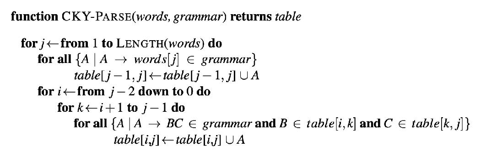

# Natural Language Processing

### Context Free Grammars

a CFGs is a system that  uses specific rules to show **how sentences** in a language **are constructed**. These rules define **how elements of a sentence are combined**.

context-free indicates that these rules does **not** depend **on the surrounding symbols**!

- Non-terminals: these are abstract symbols that represent groups of words, used to structure the sentence but don't appear in the actual text.

  sentences (S), noun phrases (NP), verb phrases (VP)

- terminals: These are the actual words in the language.

- production rules: these rules show how to build sentences by replacing non-terminals with terminals or other non-terminals

A CFG specifies a formal language. Sentences can be generated by the grammar are considered "grammatical" in the formal language, "ungrammatical" otherwise.

It is useful in NLP for:

- parsing: analysing the structure of sentences to understand their grammar
- grammar checking: identifying mistakes in sentences by checking them against grammar rules
- sentence generation, creating new sentences that are grammatically correct.

#### CKY Parsing

Chomsky normal form is a specific way of structing CFGs.

Cocke-Younger-Kasami algorithm is a parsing algorithm, used for **syntactic analysis of sentences** according to a given grammar in CNF, determine whether a given sentence **can be generated by the grammar** and, if so, to construct a corresponding parse tree.

### Language Model

A language model is a computational system used to **compute the probability** of a sentence or sequence of words.
$$
\begin{align}
	P(W) = P(W_1, W_2, ... , W_n)
\end{align}
$$
how likely a word or sequence of words is to appear in a given text. 

related task: probability of an upcoming word: $P(W_n | W_1, W_2, ... , W_n)$

The chain rule in general: 
$$
\prod_{i} P(W_i|W_1, W_2,...,W_n)
$$
word probability is estimated by word frequency, counting how frequently a word appears in a text corpus divided by the total number of words in the corpus.

To predict the probability of next words, but there are too many combination of words and we'll never see enough data for estimating the long combinations!  ------

**Markov Assumption**

simplifying assumption: the probability of a word depends only on the preceding $n-1$ words, not on any earlier context.

#### N-gram Models

In general, this is an in sufficient model of language because language has long-distance dependencies

##### Corpus

corpora are a large and structured set of texts.

corpora are used to define a language or sub-language

corpora are used to do statistical analysis and hypothesis testing, checking occurrences or validating linguistic rules within a specific language territory.

- large scale: contains extensive text data, covering a wide range of linguistic phenomona.
- structured: organised according to certain rules, making it easy to retrieve and analyse
- representative: texts come from diverse sources, aiming to reflect the real use of the target language

However, in N-gram model, one term is 0, it would cause the entire sentence probability to be 0.

Apply smoothing algorithm

##### Add-one (Laplace Smoothing)

add a small constant (usually 1) to all event counts. This ensures that every possible event has a non-zero probability.

$P(w_i) = \frac{count(w_i) + 1}{count(all \ words) + V}$      $P(w_{i+1} | w_i) = \frac{count(w_i, w_{i+1}) + 1}{count(w_i) + V}$

disadvantages: 

- over-smoothing: can make the probabilities of **rare events too high** compared to more common events.
- large reduction: if the **context word is rare**, the reduction **can be very large**.

##### Interpolation

interpolation combines probabilities from multiple n-gram models by weighting and summing them.

### Information Theory for NLP

information theory involves quantifying information, measuring the amount of information

#### Entropy

information entropy is a measure of uncertainty in **a set of data**. It quantifies the average amount of information produced by a stochastic source of data.

higher entropy means more unpredictability and more information content, while lower entropy indicates more predictability and less information 

The unit of information entropy is bit or nat.

In information theory, 1 bit of information represents the amount of uncertainty reduced when one binary question is answered.

##### Calculation

given a discrete random variable X, which takes values in the set $X$ $i.e.$ $x_1, x_2, ... , x_n \in X$

the entropy can explicitly be written as: $H(X) = - \sum_{x_i \in X} P(X=x_i)  \log_{2}P(X=x_i)$

##### Uncertainty

Entropy measures uncertainty in a system.

H(x) is always less than or equal to the entropy in the case of a uniform distribution

### Naive Bayes

#### Bag of words

bag of words is a text representation method used in NLP. it converts text into a collection of individual words, ignoring grammar and word order but keeping multiplicity.

each unique word in the text corpus is represented as a feature in a fixed-size vector, with the value of each feature being the word's frequency in the document.

#### Naive Bayes Classifier

For a document d, we should find the class $\hat{c}$ which has the maximum **posterior probability** given the document **out of all classes** $c \in C$

The Naive Bayes classifier: $\hat{c} = \underset{c \in C}{\operatorname{argmax}} P(c | d)$

By applying Bayes' rules, it gives: $\hat{c} = \underset{c \in C}{\operatorname{argmax}} \frac{P(d | c) P(c)}{P(d)}$

so $P(d | c)$ is called the **likelihood**, $P(c)$ is called **prior knowledge**, when you compare the value $P(d)$ are the same in all calculation so it can be dropped

**Bag of words assumption**: Assume position doesn't matter.

**conditional independence**: assume the feature probabilities are independent given the class c.

with the two assumptions, it gives to: $\hat{c} = \underset{c \in C}{\operatorname{argmax}} 	P(c)\prod_{W \in text}P(w|c)$

the cumulative product can lead to numerical difficulties, Naive Bayes also uses the logarithmic for representation. $\hat{c} = \underset{c \in C}{\operatorname{argmax}}[\log_2P(c)+\sum_{W \in text}log_2P(w|c)]$

#### Training the Naive Bayes

To learn the probability $P(w_i | c_j)$, we compute as the fraction of times the word $w$ appears among all words **in all documents of topic $c$.**

so the frequency are calculated **under the specific classes**. 

When applying the add-one smoothing, the size should be the size of **whole vocabulary**.

### Evaluate Language Model

#### Confusion Matrix

Two dimensions (system outputs and gold labels)

For accuracy: it measures the percentage of all observations that our system labelled correctly.

Precision: percentage of selected items that are correct

recall: percentage of correct items that are selected

**F1:** 

F1 is a combination of precision and recall. it is the harmonic mean of precision, where precision is the ratio of true positive results to all predicted positives, and recall is the ratio of true positive results to all actual positives.

1 indicating perfect precision and recall, thus providing a balanced measure of the model's accuracy **in identifying positive instances**.
$$
F1 = \frac{2 \ precision \ recall}{precision + recall}
$$

### Word semantics and word embeddings

##### vector semantics

vector semantics is the standard way to represent word meaning in NLP, helping us model many of the aspects of word meaning.

vector semantics uses **vector to represent sense of works** instead of word itself.

##### word embedding

representing a sense is **challenging**, so some works settle for **representing sense of words with vectors** instead. This is called word embedding.

##### context-based word semantics

meaning of a word by its distribution in language used

#### Term-document Matrix

a simplified approach is to consider each text in the corpus as an indivisible context and then examine the distribution of words across the entire corpus

document vectors and word vectors

##### cosine similarity for words

measure the similarity of their meanings using vector similarity, specifically cosine similarity

opposite (-1), unrelated (0), related (1)

##### Limitations

use raw frequency as vector parameters, it gives high weight to frequently occurring words.

However, these high-frequency words often **lack substantial semantic meaning**, which can significantly **disrupt vector semantics**.

#### Inverse Document Frequency (IDF)

inverse document frequency is the component of TF-IDF that measures **how important a word is across the entire corpus.**

IDF helps to balanced this by giving less importance to words that are rare or specific to a few documents.

The IDF for a term $t$ is defined based on logarithm: $IDF(t) = \log_2 \frac{N_d}{DF(t)}$

where $N_d$ is the total number of documents in the corpus, and $DF(t)$ is the number of documents in which the term $t$ appears.

#### TF-IDF

Therefore, for each vector constructed using word frequency, we can multiply each frequency by the IDF to mitigate the impact of excessively high weights assigned to common words.
$$
TFIDF(t) = TF(t, d) IDF(t) = TF(t, d) \log_2\frac{N_d}{DF(t)}
$$
$TF(t, d)$ denotes the term frequency in document $d$.

**Limitations**

- High Dimensionality: vectors tend to be very long because the vector length is equal to the size of the vocabulary. 
- sparsity: TF-IDF vectors are often sparse, meaning that they contain many zeros.

#### Word2Vec

word2vec is a neural network-based technique that transforms words into **continuous vectors**, capturing their semantic meanings.

two main approaches:  Continuous Bag of Words and Skip-Gram

it establishes a classifier to predict the relationship between each word in the corpus and its surrounding words.

没懂。。。。。。。。。。

### Transformer

the transformer is a groundbreaking model architecture, which entirely based on the attention mechanism, allowing it to process sequences in parallel rather than sequentially.

The architecture of a transformer is based on stacking multiple transformer layers.

There are many transformer layers for different takes: Encoder layer, Decoder layer, or their variants

Each layer is composed of 3 types of components: multi-head attention, feed forward network(FFN), layer normalization

#### Multi-head Attention

multi-head attention extends **Scaled Dot-Product Attention** by using **multiple attention heads** to focus on **different parts of the input** simultaneously, allowing the model to capture a wider range of relationships within the data.
$$
MultiHead(Q, K, V) = W (H_1 \oplus H_2 \oplus ...\oplus H_h) \\
H_i = ScaledDotProduct(W_{i,q}Q, (W_{i,q}K, (W_{i,q}V)
$$

#### Feedforward Network(FFN)

FFN is a two-layer fully connected network with a ReLU activation in between.

The first layer's output dimension is doubled before being reduced back to the original size in the second layer.
$$
FFN(x) = W_2 ReLU(W_1 + b_1) + b_2
$$

#### Layer Normalization

Layer normalization is one of many forms of normalization that can be used to **improve training performance** in deep neural networks by **keeping the values of a hidden layer in a range that facilitates gradient-based training**.

For each input tensor (in a batch), layer normalization normalizes it by adjusting its mean and variance, and outputs a transformed vector with the same dimensionality, but its mean and variance are adjusted to 0 and 1.

#### Transformer Encoder layer

consists of a multi-head self-attention followed by a FFN, with each sub-layer surrounded by layer normalization and residual connections.
$$
H_1 = MultiHead(x, x, x) + x \\
H_2 = Norm(H_1) \\
H_3 = FFN(H_2) + H_2 \\
Encoder(x) = Norm(H_3)
$$
注意这里的norm的位置以及residual来连接的地方

#### Transformer Decoder layer

similar to Encoder layer but with a **masked multi-head self-attention**.

After the masked self-attention, it also includes a standard multi-head attention mechanism, where the **queries** come from the **decoder** and the **keys and values** come from the **encoder's** output (called memory), then an FFN.
$$
H_1 = Norm(MaskedMultiHead(x, x, x) + x) \\
H_2 = Norm(MultiHead(x, m ,m) + x) \\
Decoder(x) = Norm(FFN(H_2) + H_2)
$$

#### Masked Attention

Typically, attention weights are calculated based on all elements of the input, and each output of the attention mechanism is a **weighed average of all the input elements**.

problematic when particular word should not depend on words that appear later in the sequence.

#### Transformer Encoder-Decoder Architecture

designed for sequence-to-sequence tasks.

- encoder outputs the memory
- each decoder layer receives memory
- the previous output tokens are input back into the decoder
- the decoder only generates one text token at a time

