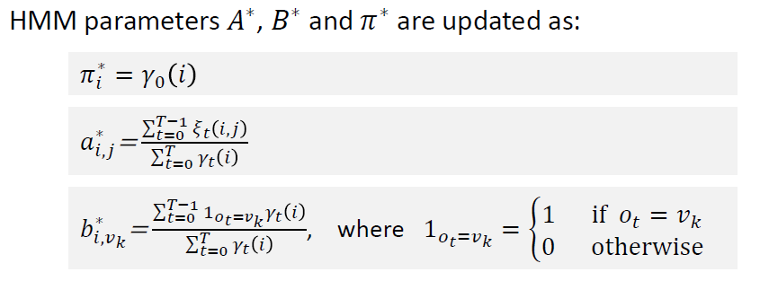

## Probability theory

这里主要是记录一点名词，没必要重复概念了

stochastic (random) system, random variables (discrete, continuous), cumulative distribution function (discrete, continuous), expectation, variance and standard deviation

common probability distribution:  uniform distribution, Gaussian distribution

joint probability distributions: x and y are independent variables only $f_{XY}(x,y) = f_X(x)f_Y(y)$

conditional probability: 只需要掌握贝叶斯公式

Covariance: $Cov(X,Y)$ is a measure of joint variability of two random variables X and Y:

$Cov(X,Y) = E[(X - E[X])(Y-E[Y])]$  注意这里中间是相乘的 $E[XY] - E[X]E[Y]$

#### Bayesian inference

probability of a hypothesis is updated using Bayes' theorem

assuming observation x follow a hypothetical distribution $p(x|\theta)$ , where $\theta$ is the parameter of the distribution, we can relate the distribution as: $p(\theta|x) = \frac{p(x|\theta)p(\theta)}{p(x)}$

we may be able to guess or estimate the distribution $\theta - p(\theta|\alpha)$ , where $\alpha$ is a hyperparameter

主要就是对Naive Bayesian的更广泛的定义

## Gaussian Processes

**Formal definition:**

A stochastic process {f(x)} such that for any finite set {x1, .... xn}, the vector $f = [f(x_1),...f(x_n)]$ follows a multivariate normal distribution

**Gaussian Process Regression:**

目标函数是，$p(f_* | X, y, x_*)$

**联合分布**和**条件分布**，以及**后验均值**和**后验方差**的计算方法。

高斯过程中，我们关心的是输出y和在新输入点x出的函数值f之间的联合分布

基于联合分布，我们可以得到在给定观测数据y的情况下，f的条件分布

## Hidden Markov Models

transaction matrix

frequency of state as $N_t(y) = \sum^t_{s=0} Pr(X_s=y)$

Occupancy matrix: 不知道有什么用，但是就是在有initial state的情况下计算可能的y的frequency of state

limiting distribution and equilibrium distribution 极限分布和平稳分布

定义是：$\sum_{x\in S}\pi(x)P(x,y) = \pi(y) \forall y \in S $ 

稳态分布是唯一的，所以可以通过一个方程组来计算出对应的平稳

**hidden markov models**: 进入正题

the states X of the underlying Markov model cannot be observed directly, but only through another "depending" process.

The observable states Y depend on the states of the HMM at certain probabilities.

$Pr(y) = \sum_{x\in A} Pr(y|x)Pr(x)$

隐马尔可夫的假设：

- 给定当前状态，未来的状态与夺取的状态无关
- 给定当前的隐状态，当前的观测值与之前的观测值无关

#### Definitions for HMM

State space of **n** states for Markov model S;  Transition probabilities (matrix) **A;**  set of m observed symbols **V**;  Observed symbol probability matrix **B**;   Initial state distribution $\pi_i$

problem: compute the probability of observed sequence $O = \{O_0, ... , O_T\}$, given the parameters $\lambda = \{A, B, n, m, \pi\}$ are known.

solution: decompose the problem by summing the probabilities for all the possible hidden state sequences $Q = \{q_0, ... , q_t\}$ :     $Pr(O|\lambda) = \sum_{all Q} Pr(O|Q, \lambda) Pr(Q|\lambda)$   这里的Q其实就是所有可以满足O出现的一系列状态的可能性    

we can solve the probability for O (observation) by using forward algorithm

the probability of seeing the sequence of observation O and ending in state $s_i$ is :

$\alpha_t(i) = Pr(O = \{o_0,o_1,...,o_t\}, q_t=s_i|\lambda)$ 

- initialization: $\alpha_0(i) = \pi_i$
- induction: $\alpha_{t+1}(j) = [\sum^N_{i=1}\alpha_t(i)a_{i,j}]b_{j, o_{t+1}}$
- termination: $Pr(O|\lambda) = \sum^N_{i=1}\alpha_T(i)$  

有一个疑惑的点，就是应该是先观测再转移还是先转移再观测 （解答确实是先转移再观测，所以$O_0$ 存在的意义是什么？）

#### Viterbi Algorithm

more interested in solving the most probable sequence of hidden states $Q = \{q_0,...,q_t\}$ 

given the sequence observed states O and the HMM definition

也可以根据上面的induction来最变换，得到想要的最大的路径，不取sum而是改为max_i即可

- initialization: $\delta_0(i) = \pi_i b_{i, O_o}$ ;               $\psi_0(i) = 0$       这个是用于记录最大值的
- Recursion$: \delta_t(j) = \mathop{max}\limits_i[\delta_{t-1}(i)a_{i,j}]b_{j,o_{t+1}}$ ;    $\psi_t(j) = \mathop{argmax}\limits_{1\leq i\leq n}[\delta_{t-1}(i)a_{i,j}]$ ; 这里只需要关注转移的概率
- Termination: $P^* = \mathop{max}\limits_{1\leq i\leq n}[\delta_T(i)]$ ;    $q^*_T = \mathop{argmax}\limits_{1 \leq i \leq n}[\delta_T(i)]$ 
- Back-Tracking:  $q^*_t = \psi_{t+1}(q^*_{t+1})$   把后一个的最佳状态带进去，得到这一轮的最佳状态（因为是由最佳的t，才能在t+1的时候来到q_t+1

#### Learning the HMM parameters

problem: find the most likely $\lambda = \{A,B,\pi\} ; argmaxPr(\lambda|O)$ 

sequence of observation O is considered as training data, want to find out the maximum likelihood estimate (MLE) pf the model parameters $\lambda$  

也是用贝叶斯来通过先验知识来学习这个后验知识 $Pr(\lambda|O) = Pr(\lambda) Pr(O|\lambda)$

we cannot usually estimate $Pr(\lambda)$, just assume that all the models are equally likely; therefore, ignore this and **just optimize $Pr(O|\lambda)$** 

##### iterative learning algorithm

define a general iterative procedure to **find a better model given old model**, as:

- start with an initial model $\lambda_{old}$ (randomly chosen initial state and random non-zero values for two matrix) 
- compute $\lambda_{new}$ based on $\lambda_{old} \  \ \ \&  \ \ \ O$
- if $Pr(O|\lambda_{new}) \gt Pr(O|\lambda_{old})$, update $\lambda$ and return to step 2
- stop and return the solution 

##### Baum-Welch algorithm

接下来需要解释从第三步开始，计算的方法

**backward process:**

- definition: $\beta_t(i) = Pr(O | q_t = s_t, \lambda)$
- initialization:    $\beta_T(i) = 1$
- induction: $\beta_t(j) = \sum^N_{i=1}\beta_{t+1}(i)a_{j,i}b_{i,o_{t+1}}$ 

**normalization**: 

the problem of computing $\alpha and \beta$ is that the value get smaller and smaller when t gets larger, which may lead to underflow.

利用那一组的值，来normalize每个元素的数值 $\alpha_t(i):= \alpha_t(i) / \sum^n_{j=1}\alpha_t(j)$

##### compute temporary variables $\gamma_t(i) \ and \ \xi_t(i,j)$ 

##### update based A,B, PI on the variables

## Fuzzy Logic

deal with reasoning that is approximate rather than fixed and exact

many concepts in fuzzy logic follow boolean logic , but taking the uncertainties and inaccuracies of real-life phenomena into account.

allow using vague linguistic rules to control system.

**fuzzy logical variables:** use values ranging from 0 to 1

example: variables: cold and hot; it could be cold = 0.5, hot = 0.5

**fuzzy logical operators**: try to mimic boolean logical operators as long as possible

note that when x=0 or x=1 and y=0 or y=1, boolean and fuzzy operators give the same results.

主要的意义就是通过计算一些值，来代替绝对的逻辑，可以更加适应现实中的多样性

#### fuzzy set

fuzzy set is a pair (U,m), where U is a set and m is a **membership function** with range [0,1], defining degrees of membership

Given that $x \in U$, we can say that m(x) = 0, x is not included;  m(x) = 1, x is fully included;  0 < m(x) < 1, x in partially included

classical "crisp" set is: $m(x) = 1 \forall x \in U$

#### Mamdani fuzzy system

three parts:

- fuzzification: assign values to the membership functions for fuzzy reasoning, according to the system input.
- fuzzy reasoning: apply the rules from the fuzzy knowledge base to the fuzzy input set to perform the desired task of the system
- defuzzification: convert the fuzzy results to crisp output values.    (why needed)

linguistic variables: are the fuzzy sets used to apply fuzzy rules in natural language

- a descriptive name and a fuzzy set with members
- a range of values universe of discourse

fuzzification: takes crisp numerical input values and map them into degrees of truth in one or more linguistic variables.

fuzzy inference: use the fuzzy rule to generate fuzzy output from fuzzy input.

fuzzy inference rules are written in form of if-then statements

defuzzification: process of obtaining crisp output values from the fuzzy linguistic output variables.

- Mean of Maxima (MoM) 最大值均值法

  find the points where the degree of membership reaches its maximum

  then, compute the mean of the output values x corresponding to the points with maximum degree of membership

- Center of Gravity(COG) method

  the fired areas below all the membership functions are considered jointly to compute the center of gravity

  求的是很大范围下的截断数值下的面积
  $$
  x^* = \frac{\int_x x\cdot\mu(x)\, dx}{\int_x \mu(x)\, dx}
  $$

- center of area (CoA) method, centroids are computed separately for each area and then combined

  but include overlapping areas twice

  现根据COG的公式求得每个area下的重心位置，然后使用公式 其中这里$A_i = \int_{x_i} \mu(x_i)\, dx$
  $$
  x^*=\frac{\sum^n_{i=1}A_ix_i^*}{\sum^n_{i=1}A_i}
  $$

#### Sugeno fuzzy system

computationally more efficient than Mamdani system, but fuzzy rules are less intuitive and interpretable, output is just the computed as weighted sum of the outputs

Therefore, the sugeno system generate both output (directly defined by the rule!) and weight (computed by membership value with fuzzy operator)

## Genetic algorithms

search algorithms inspired by natural selection

- 每个search结果的fitness都会根据目标结果进行评估
- 最fit的结果会被选出来，然后继续这个流程
- population recombined through crossover and mutation operations

**terminology:** 

- population: is a subset of **all the possible encoded solutions** to a given problem
- chromosome: is one of the **possible solutions**
- gene: is one element **position** of a chromosome
- allele: is the **value of a gene** for a particular chromosome

encoding of chromosomes: is essential to represent the necessary information for the solution

most common encoding methods include **binary encoding, value encoding and permutation encoding**.

**common genetic algorithm structure:**

- initial population: random or heuristic initialization producing hundreds or thousands of chrmomsomes
- apply fitness function to the population
- select the fittest chromosomes from the population to form the next generation
- generate offsprings using genetic operators (crossover and mutation)
- test for termination criteria, (not go to step 2)

**fitness function**:  takes a candidate solution (chromosome) as input and gives a suitability estimate of the solution as output

**survivor selection**: can be selected based on the **fitness** or the **age**.

**parent selection:** Subset of survivors selected as parents for offsprings (rank selection, but slow to converge), different selection methods exist to increase genetic variance.

- tournament selection: first pick randomly k chromosomes; then choose **the fittest of the picked individuals as parent**, process is repeated until the desired number of parents are selected
- Roulette-wheel selection: **random selection weighted** so that the probability to be **selected is proportional to fitness.** $p_i = \frac{f_i}{\sum^N_{j=1}f_j}$ 

**genetic operators:** 

- crossover: **parts of chromosome** swapped between parents
- mutation: values of some genes (alleles) randomly changed

crossover applied first before mutations.

**variants of crossover**: 

one-point cross-over: on fixed sections

two- and multi-points crossover: applied to three or more sections in randomly selected positions

uniform crossover: for each position, crossover is decided independently with equal probability

**Variants of mutation **: Bit flip; swap, scramble, inversion, small changes, random resetting

termination criteria:  from the fitness evaluation or just some hyperparameter defined

#### GA approaches to learn fuzzy rules

Michigan approach: whole population represents the rule base; no crossovers used; applied at the level of an individual chromosome

pittsburgh approach: each chromosome encodes a whole fuzzy rule base, crossovers generate new combinations of rules; mutations generate new rules

iterative rule learning approach: chromosomes represent individual rules, but only the best rule is adopted in the final rule base

## Swarm intelligence

swarm intelligence is based on the idea that autonomous agents can solve complex tasks together by **following simple rules**.

it is **decentralized**: agent decide their actions **independently** based on their interaction with the environment (no predefined leader)

**Basic principles:**

- the swarm can solve complex problems that a single individual with **simple abilities** could not solve
- the performance of the swarm is not affected by **loss of one individual or a mistake by one individual**
- individuals have **local sensory informatio**n and thy can perform simple actions, but they have little or no memory, and they do not know about the status of the swarm **as a whole or its goal**

### Particle swarm optimization (PSO)

goal: find the area of the highest concentration of insects

background settings: the birds can **signalize** their position and the food concentration there to **their neighbors**; birds can remember their **past position of the best food concentration.**

##### programming 

**Each particle $i$** is described by its current position $x_i$, best known position $p_i$, velocity $v_i$, and cost function values  $f(x_i)$ and $f(p_i)$. 每一个都要记录现在位置，最佳位置，速度，还有消耗函数

**Goal**: we want to find the position that minimizes the cost function 

**Initial settings:** positions and velocities of the particles are initialized randomly, initialize  $p_i$ is set to $x_i$; the swarms best known position $g$ is set to the $x_i$ that minimizes $f(g)$. 一开始最佳位置就是现在位置，全局最佳位置是所有当前位置使得cost function 最小的位置

**PSO velocity update**: random values $r_p, r_g - U(0, 1)$ are chosen for each particle, and velocity updated as: $v_i \leftarrow wv_i + \varphi_p r_p (p_i - x_i) + \varphi_g r_g (g - x_i)$. Repeat for each dimension. $w, \varphi_p, \varphi_g$ are set by the controller of the algorithm. 公式的意思就是一部分的原始速度，然后根据自己的最佳位置与当前的距离，全局最佳位置与当前的距离，更新公式，权重既有predefined的也有uniform中取样的

**PSO position update:** $x_i \leftarrow x_i + v_i$ 

**PSO termination:** all particles are eventually expected to approach the global optimum.

$\uparrow$

**Baseline** version of PSO uses global topology. all particles know the global best position.

Particles could also share information only with **a subset of particles** (geometrical subset, social subset)

#### Stigmerky

indicates communication between individuals through modification of the environment

leave signs that others can observe, signs may decay over time

### Ant Colony optimization (ACO)

- initially, wander randomly to looking for food
- Upon finding food, they return colony while leaving a pheromone trail to mark their route
- other ants are likely to follow the trail and reinforce it in case they also find food

problem definition: find the shortest path on a weighted graph

each edge from node x to y is characterized by their length $\eta(x, y)$ and pheromone level $\tau(x, y)$ 

ant k choose edge based on following probability distribution: $p_k(x,y) = \frac{\tau(x, y)^\alpha \cdot \eta(x, y)^\beta}{\sum_{z \in S} \tau(x, z)^\alpha \cdot \eta(x, z)^\beta}$

parameters $\alpha \ and \ \beta$ define the relative weights of $\eta \ and \ \tau$

**local pheromone update:** $\tau(x, y) \leftarrow (1 - \rho)\tau(x, y) + \rho \tau_0$ (不太懂什么意思了)

**global pheromone update:**  $\tau(x, y) \leftarrow (1 - \rho)\tau(x, y) + \sum^m_{k = 1}\Delta \tau_k(x, y)$ 

## Artificial neural network

### Initialization

simplest method is zero initialization but often used for biases

Normal initialization uses narrow Gaussian distribution $N(0, 0.01)$ 这里的variance很小所以会很narrow

- Glorot (Xavier) initialization: $w_i - u(-\frac{\sqrt{6}}{\sqrt{n_{in}+n_{out}}}, \frac{\sqrt{6}}{\sqrt{n_{in}+n_{out}}})$ uniform distribution
- He initialization: $w_i - N(0, \frac{2}{n_{in}})$ 正态分布中抽样

He works better with ReLU activation, Glorot (Xavier) works better with Sigmoid and Softmax

good idea to use different initialization for different layers

both methods assume normalized input, so batch normalization layer is good choice

### Optimizer

SGDM, Adam $\theta^{(t+1)} = \theta^{(t)} - \alpha\frac{m^t}{\sqrt{v_t}+\epsilon}$

adam converge faster, but sgdm is more robust to overfitting, adam is more robust to bad parameter choices

sgdm is the first choice to train CNNs, whereas Adam is first choice to train transformers

### learning rate scheduler

step-based decay, exponential decay, cosine annealing, cyclic learning rate

#### Overfitting

strategy:

- early stop

- L1 and L2 regularisation: 

  L1 unimportant weights likely to have small values, reducing model complexity (when some data are irrelevant)

  L2 is helpful to stabilize and smoothen the model, but not eliminate irrelevant features

- Dropout: sets part of the input values randomly to zeros, helps model find alternative paths to reach similar output, making model more robust

  - dropout: up above
  - dropout scaling: during training, dropout layer should scale the inputs not set to zero by 1 / (1 - r) to keep the **sum of the input statistically unchanged**
  - Gaussian dropout: Gaussian noise is added to the input. random multiplier follows 1-centered Gaussian distribution; statistical distribution of the values does not change, so there is no need for additional scaling of the inputs 随机扰动让神经网络更具鲁棒性，防止过拟合。
  
- data augmentation: increase number of training samples. 

## Recurrent Network

RNN can be used for sequence-to-sequence, sequence-to-one, one-to-sequence

In RNN, output $y_t$ for time step t is not dependent only on the corresponding input $x_t$, but also on the hidden state $h_t$ 

basic RNN computations:
$$
h_t = \varphi(W_h h_{t-1}+W_xx_t+b) \\
y_t = \varphi(W_yh_t)
$$
原来是先使用前一个的隐状态和当先的输入，计算出当前的隐状态，然后基于这个隐状态来计算y的输出

often tanh is used as activation function in RNNs

#### Sequence to one

used for classifying sequence

text is mapped to **numerical vectors** and end with a special token denoting the end of sentence.

training: time steps can be considered as layers with **shared weights**. gradients for different time steps will not be the same: compute the **average for recurrent weight gradients** for optimization

### one to sequence 

for generating text

CNN is used to generate a vector representation of the image

use output as input to the following time steps

each output contributes to the loss individually, so each time step adds an additional loss term in the total loss

### sequence to sequence

can be implemented for synchronized output or delayed output

synchronized output used for rolling prediction of time series

delayed output is useful, system needs to receive the whole input sequence before starting to generate output.

### Encoder decoder RNN

Encoder encodes the input as hidden state, decoder generates output

encoder use sequence-to-one, and decoder use one-to-sequence

### bidirectional RNN

beneficial for RNN to use also the future inputs

Bidirectional RNN generates the output using two hidden states: one computed using the original sequence, the other one using it reversed

### GRU and LSTM

hidden state should include information of all the past inputs, however the information from the past gets diluted, since deep models suffer from vanishing gradient

**LSTM**:

The intuition behind LSTM is that the networks learn **when to remember and when to forget information**

three **types** of gates to control the flow of information

each gate is in practice a linear layer with learnable parameters

has memory cell $c_t$ 

**four gates** to decide which information to forget and keep: 

- forget gate decides which information to discard from $c_{t-1}$
- input gate decides which new information to store $c_t$
- output gate decide what information to output in $h_t$

**GRU**

simpler than LSTM with less gates and hidden information

perform as well as LSTM

GRU includes a gating mechanism to input or forget certain features.

GRU does not have an output vector: hidden state can be used as output

 

$z_t$ is the update gate vector that emphasizes the elements in hidden state that should be updated

$r_t$ is the reset gate vector that emphasizes the elements in hidden state that should be forgotten

## Attention and transformers

### scaled dot-product attention

attention A formulated as a function of query, key and value metrices Q, K, V with parameter $d_k$ indicating the length of keys: $A(Q	,K,V) = Softmax(\frac{QK^T}{\sqrt{d_k}})V$ 

 encoder only are useful for text classification type of task

decoder only are useful for text generation without input

