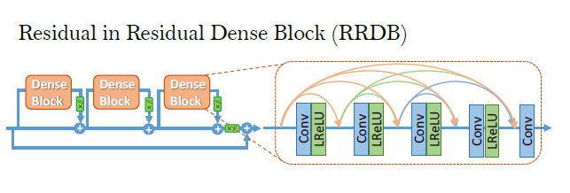
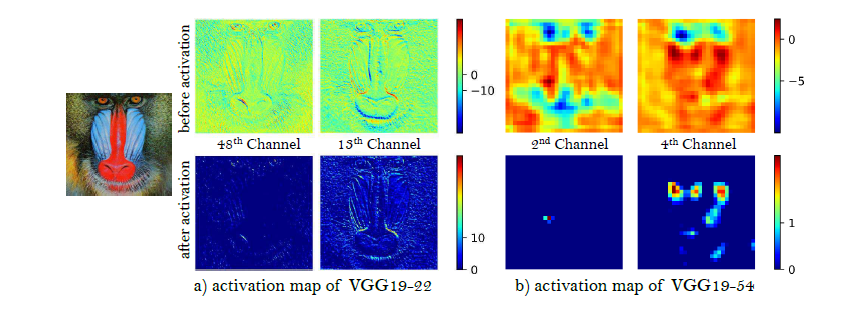

# ESRGAN: Enhanced Super-Resolution Generative Adversarial Networks

## Abstract

the super-resolution generative adversarial network (SRGAN) is a seminal work that is capable of generating realistic textures during single image super-resolution

three key components of this network: network architecture, adversarial loss and perceptual loss

introduce residual-in-residual dense block (RRDB) without batch normalization as the basic network building up unit

borrow the idea from relativistic GAN to let the discriminator predict relative realness instead of the absolute value.

improve the perceptual loss, by using the features before activation, which could provide stronger supervision for brightness consistency and texture recovery.  

## Introduction

Peak signal-to-noise-ratio value

these PSNR oriented approaches tend to output over-smoothed results without sufficient high-frequency details, since the PSNR metric fundamentally disagrees with the subjective evaluation of human observers.

then several perceptual-driven methods have been proposed. 

optimizing the model in a feature space instead of pixel space.

GAN are introduced to encourage network to generate more natural images

SRGAN  is built with **residual blocks and optimized using perceptual loss in a GAN framework**

this study:

- RDDB:  remove batch normalization and use residual scaling and smaller initalization
- improve discriminator using Relativistic average GAN
- improved perceptual loss by using the VGG features befor activation instead of after activation as in SRGAN

## Proposed Methods

### Network Architecture

- remove BN layers
- replace original basic block with the proposed residual-in-residual dense block, which combines multi-level residual network and dense connections

reason for remove BN: it has proven to increase performance and reduce computational complexity in different PSNR-oriented task. BN layers tend to introduce unpleasant artifacts and limit the generalization ability. Furthermore, removing BN layers help maintain stable performance, generalization ability and to reduce computational complexity and memory usage.

reason for residual-in-residual dense block: the observation that more layers and connections could always boost performance the proposed RRDB employs a deeper and more complex structure

**residual learning is used in different levels.** dense block with connection, residual connection to form RRDB block, and then stack and residual connect multiple RRDB blocks.

Addition works:

- residual scaling, scaling down the residuals by multiplying a constant between 0 and 1 before adding them to the main path to prevent instability
- smaller initialization, it would be easier to train when the initial parameter variance becomes smaller

### Relativistic Discriminator

a relativistic discriminator tries to predict the probability that a real image $x_r$  is relatively more realistic than a fake one $x_f$

#### 先学习一下什么是discriminator

从原理上来讲，discriminator是一个二分类 的模型，负责判断输入数据是真实的还是生成的。然后就可以指导生成器的训练

所以从损失函数上，我们就可以尝试对真实图像的概率以及假图像的概率做优化来形成损失函数
$$
L 
D
​
 =−E_ 
{x∼p_
{data}
​
 (x)}
​
 [logD(x)]−E _
{z∼p_{
z}
​
 (z)}
​
 [log(1−D(G(z)))]
$$
我需要最小化这里的loss，也就是想要模型能尽可能的把正确的判断到1，也就是判断正确，相反的，假图像通过被1减之后也是起到相同的作用。

#### look into the discriminator in this paper

$D_{Ra}(x_r, x_f ) = \sigma (C(x_r) − E_{x_f} [C(x_f )])$ where the $E_{x_f} [ ] $ represents the operation of taking average for all fake data in the mini-batch （由此我觉得，这里要使用到ground truth来辅助取出所有的fake data 的feature 然后再得到expectation 也就是均值）

最后的loss是如下：

- discriminator

$$
L^{Ra}
_D = −E_{x_r} [log(D_{Ra}(x_r, x_f ))] − E_{x_f} [log(1 − D_{Ra}(x_f , x_r))]
$$

- generator

$$
L^{Ra}
_G = −E_{x_r} [log(1- D_{Ra}(x_r, x_f ))] − E_{x_f} [log(D_{Ra}(x_f , x_r))]
$$

generator benefits from the gradients from both generated data and real data in adversarial training

### Perceptual Loss

背景知识：感知损失是一种用于图像生成和图像修复任务的损失函数，它与传统的像素级损失（均方损失误差不同），侧重于图像的高层次特征。

核心思想是图像的内容和视觉质量往往在高级特征层次中得到更好的表达。

定义为两张图像在某一中间层（如VGG网络的某一卷积层）输出特征的 **差异**。常见的差异度量方式包括 **欧几里得距离（L2范数）** 或 **余弦相似度**

这篇文中对这个loss做了一些改变: we purpose to use features before the activation layers, which will overcome two drawbacks of the original design. 

- activated features are very sparse, The sparse activation provides weak supervision and thus leads to inferior performance. 
- also causes inconsistent reconstructed brightness compared with the ground-truth image

### Network interpolation

To remove unpleasant noise in GAN-based methods while maintain a good perceptual quality, propose a flexible and effective strategy - network interpolation 

pass

## Experiments

all experiments are performed with a scaling factor of $\times4$ between LR and HR images. 

first train a PSNR-oriented model with L1 loss

then employ the trained PSNR-oriented model as an initialization for the generator with following loss function
$$
L_G = L_{percep} + \lambda L^{Ra}_G + \eta L_1
$$

