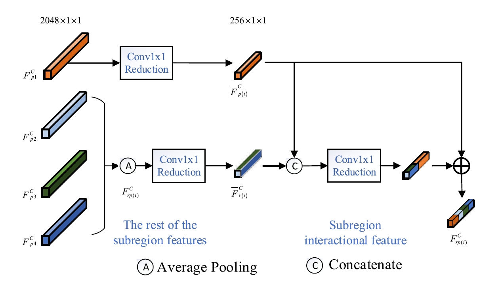

## TBE-Net: A Three-Branch embedding network with part-aware ability and feature complementary learning for vehicle re-identification

### introduction

contributions:

- three branch network improve the performance of current models
- present the flexible local attention module
- propose a complementary branch

it seems that the complementary branch is important because it provides structural features and multi-granularity features. 

a new sub-region interaction module is introduced to make full use of the relations between the divided sub-regions.

### related work

**global feature**: helpful for grasping the global appearance feature of the vehicle, these models do not have the ability to perceive distinguishable details from local regions of vehicle.

**local region feature**: local regions may constantly change under cross-camera video surveillance, limiting the application of these methods based on pre-defined fixed key feature points and local regions.

**attention-based methods:** not many arguments

**different size pooling:** different granularity features tend to have different information expressing abilities. global average pooling operation can integrate the spatial relationship between feature maps, and the global maximum pooling can gather the salience (outstanding) information of the feature maps.

### Methods

#### backbone

to obtain larger size and more detail information, modify the stride of last convolution layer as 1.

#### Global branch

use the global average pooling operation 2048x1x1

then use a conv1x1 to reduction the block to 256x1x1

follow with batch norm ,relu activation

use cross-entropy to train the branch

#### Local branch

Firstly, the model exploits a vehicle part parser to get masks of vehicle parts, by which **local region features** of vehicles parts **can be extracted**. 

Then the extracted **local region features** are input into the L-ATT module to learn the attention score of different parts. 

原文另外一种表达是，首先获取车辆不见的mask，然后就可以进行根据mask下的局部区域进行特征提取。

##### vehicle part parsing

YOLO is adopted to obtain local regions of vehicle parts. two steps:

- it selects local regions of vehicle parts, such as lights, brand logos
- next, extracts local regions by the bounding box detection network.

if some local regions cannot be detected well, the undetected local region is estimated with the help of the local regions detected correctly.

to compute the mask-guided local region feature $F^l_i$, use formula: $F^l_i = \{Masks_i\}^N_{i=1} \otimes F$

为什么这里i要等于1？怎么进行element-wise相乘的还是不明白

##### local attention learning

relies on a spatial attention mechanism to adaptively learns the attention scores, as follows:

- apply mask global average pooling operation on the local region feature, where MGAP can precisely restrict the average pooling areas in feature map via different local region masks.  (这里pooling之后的大小是多少？为什么要先进行一个pooling，pooling之后分辨率感觉是不变的啊)

  这里从公式上可以学到很多东西：$MGAP(F^l_i) = \frac{\sum^{16}_{j,k=1}Mask_i(j,k) \otimes F(j,k)}{\sum^{16}_{j,k=1}Mask_i(j,k)}$ 

  首先，mask的大小也要是16x16维度的，所以最终是要对YOLO出来的mask做操作

  其次，这里的GAP是得到一个标量，为什么还能不改变HW的？这是没有弄懂的一个点。
  
- the local region features are summed along the feature channel, and the importance of different regions is learned through the sofmax layer mapping function to obtain attention scores $w_i$ 

  我现在就将这个简单的理解为就是空间注意力机制的应用，那为什么最后输出的结果会是一个2048x1x1的向量呢？

所以现在这里主要有三个问题，mask如何与特征图相乘，MGAP到底是怎么操作的，有什么意义，最后的输出结果为什么会是一个2048x1x1的向量。

#### Complementary branch

first copy the feature map of the backbone network and independently use it for feature learning. 

second, applies the global max pooling to extract features and then pooled features are further divided into four sub-regions.

To obtain more discriminative and complete structural features features, a new sub-region interaction models is introduced to **learn the relations** between the divided sub-regions and **further encourage them to leverage the information of other sub-regions** besides its own effective information.

In addition, it also use different pooling operations by setting multiply pooling factors to extract multi-granularity-features.

##### SIM

based on the archtecture, we can go through the process easier.

- apple a gobal maximum pooling to extract features, and then divided into four sub-regions as the input of the  image.
- for each sub-region, they would go through the block one-by-one and generate four different feature presentation

##### multi-granularity features

GAP and GMP are used to obtain coarse-grained features.

AAP and AMP are used to obtain the fine-grained features. 

learned by triplet loss and id loss simultaneously. So a BNNeck is necessary to avoid the inconsistent in gradient direction

reasons: The integration of the BN operation improves the sparsity of each dimension of features in the batch and enables these features to be distributed near the hypersphere, which aids ID loss function to optimize these features.

and then fuse the features according to the feature size

to predict the indentity class, a head block is introduced to obtain probability

The head block contains a batch normalization (BN) layer, a leaky-relu layer, a convolutional (Conv) layer, another batch normalization layer and a fully connected (fc) layer to predict the vehicle identity.

#### For testing stage

only use the global feature extracted by the trained model for vehicle matching.

#### Evaluation Metrics

mean Average Precision (mAP) and Cumulated Matching Characteristics (CMC)

##### mAP

measures the overall performance of the model and represents the average accuracy of the recoginition results.
$$
mAP = \frac{\sum_{q=1}^QAP(q)}{Q}
$$
where $Q	$ represents the total number of query images in query set and $AP(q)$ represents the average precision retieval results of each query image $q$ that is formulated as following:
$$
AP = \frac{\sum_{k=1}^n P(k) \times gt(k)}{ N }
$$
n is the total number of the image in dataset, N represent the total number of images of the target vehicles

$P(k)$ represents the accuracy of the first k retieval result sequences and gt(k) represents whether the target vehicle amongs the first k results.
